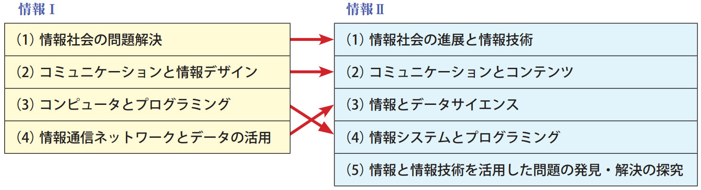
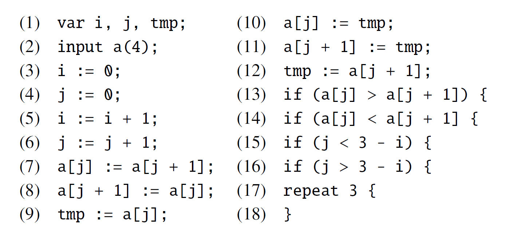
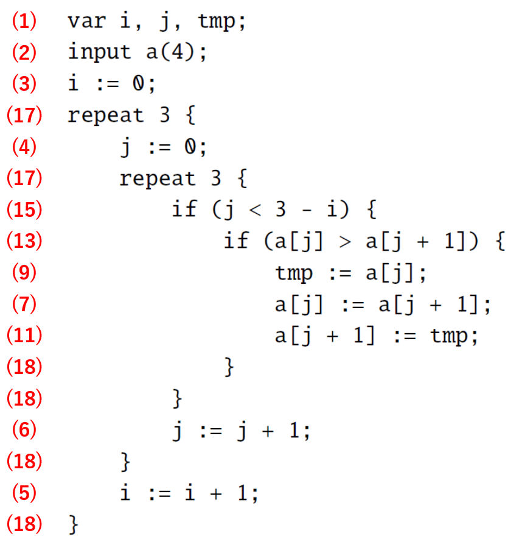
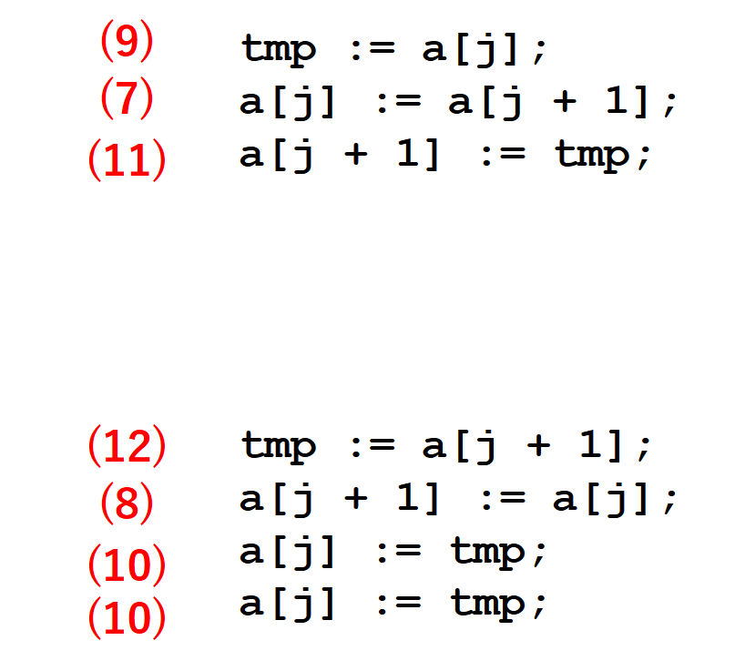
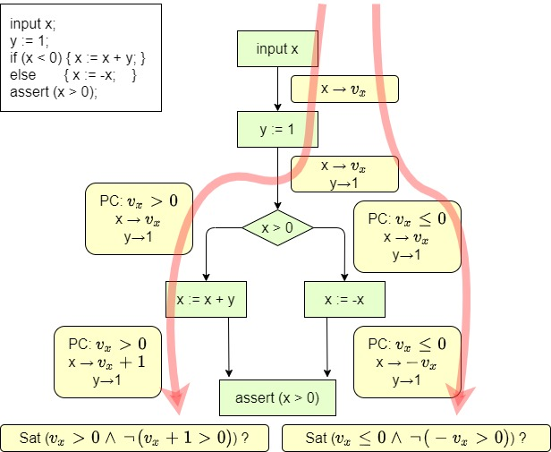

## プログラミングの試験

* 問題
    * 入力で与えられる配列 a の要素のうち，正の数を数えて，
	  変数 count に格納せよ．

* 解答

```plaintext 
var count, i;
input a(10);
count := 0;
i := 0;
repeat 10 {
    if (a[i] > 0) count += 1;
    i += 1;
}
```
<!-- .element: style="font-size: 100%;" -->


* 自動採点を行いたい．


---

## 背景

* 2022年から高校で新学習指導要領開始
* すべての高校生がプログラミングを学ぶ
  * 情報科: 「情報I」必履修，「情報II」選択
  * 「情報I」: プログラミングを含む

<p></p>

<div class="mysmall myright">
<div></div>
出典: 高等学校情報科「情報Ⅰ」教員研修用教材 (文部科学省) 
</div>

<p></p>

* 大学入試でもプログラムを作成させる問題が出せる
  * 出題に関する検討．(例: [1])

---

## 自動採点

* 必要性
  * CBT (Computer-Based Testing) で，終了後に即座に採点して結果を返す場合
  * PBT (Paper-Based Testing) でも，共通テストのように，多数の答案を処理する必要がある場合

* 可能性
  * 多肢選択型問題では可能
    * 受験者の能力を問う適切な設問とは? (Cf. [2])
  * プログラムを作成させる問題では?

---

## テストスイート方式

* プログラムへの入力 (テストケース) と，
  それに対する正しい出力 (オラクル) を多数用意
* 提出された解答プログラムにテスト入力を与え，
  出力をオラクルと比較する．

<p></p>
  
* 競技プログラミングで，広く用いられている．
  * 例: https://atcoder.jp/contests/agc049/submissions/18093458

---

## テストスイート方式

* 良い点
  * 自動的に，短時間で，採点が可能
  * 正解プログラムは，必ず正解と判定する
* 注意を要する点
  * 環境によってはセキュリティ対策が必要
  * 不正解プログラムを，正解と判定しうる
    * 「嘘解法」
    * テストケースを増やせば誤判定を減らせるが，完全を期すことはできない．

```plaintext
count := 0;
i := 0;
repeat 10 {
    if (a[i] > 0 and a[i] != 19937) count += 1;
    i += 1;
}
```
<!-- .element: style="font-size: 100%;" -->

---

## 本研究の貢献

<p style="margin-top: 40pt;"></p>

* 正しく自動採点が行えるプログラミング言語と，その採点方式の提案

<p style="margin-top: 40pt;"></p>

* 検証できる内容
  * 任意の入力に対し，正解プログラムと同一の出力を与える，もしくは
  * 一定の方法 (Presburger論理式) で表現できる性質を満たす

<p style="margin-top: 40pt;"></p>

* 言語の記述能力には相当な制限がある
* 正しさの保証は原理的なものなので，適用可能性は検討が必要

---

## 発表の流れ

* <span style="color: gray;">背景・動機</span>
* 試験の方式
* 準備: Presburger算術
* 提案言語
* 採点の手法
* 議論

---


## 出題方式

* テキスト  (CBT/PBT)
  * プログラムをいちから書かせる．
* 短冊  (CBT/PBT)
  * プログラムを構成する行「短冊」を選択肢として与える．
    受験者は，選択肢を並べ替えてプログラムを作成する．
* ブロック  (CBT)
  * ブロックを組み合わせてプログラムを作成させる．
* 穴埋め  (CBT/PBT)
  * 穴の空いたプログラムを提示し，書き込ませたり，選択肢から選ばせる．

<p></p>

<strong>本発表では，短冊やブロックによる出題を想定</strong>


---

## 短冊型出題例

短冊を並べ替えて，
長さ4の配列aに格納された整数を昇順に整列するプログラムを作れ．



---

## 短冊型解答例



---

## 正解は1つではない



---

## Presburger 算術

* $\textrm{Th}(\mathbb{Z}, 0, 1, =, +, -, <)$ のこと
  * 足し算あり，掛け算なし
    * 定数倍は書ける
* 決定可能 [Presburger 1930]
  * 限量子除去
  * 計算量: 2EXPSPACE くらい
  * 適当に制限をつければ実用的
    * (例) 限量子ブロックの長さに上限をつけた $\Pi_2$ 論理式は，
	  多項式時間で決定可能
  * Z3などのSMT solverに実装されている

---

## 提案するプログラミング言語

* C/Javaふうの，手続き型言語
* データは整数のみ
* 定数長配列あり
* 制御構造
  * if 文
  * 定数回繰返し文
  * 非常に強い制限の付いた while 文
* 以下の検証が (原理的には必ず) 可能
  * Presburger 論理式を指定した assert
  * プログラムが終了する
  * 配列の添字が範囲内

---

## 文法

<pre>
プログラム = { 宣言 } , { 文 }
宣言 = ( "var" | "input" ) , 変数宣言 , { "," , 変数宣言 } , ";"
変数宣言 = 変数 | ( 配列 , "(", 定数 , ")" )
文 = ブロック | 入力文 | 代入文 | 条件文 | 繰返し文 | break文 | 条件繰返し文 | assert文 | assume文 
ブロック = "{" , { 文 } , "}"
入力文 = "input" , ( 変数 | 配列 )
代入文 = ( 変数 | 配列要素 ) , ":=" , 表現 , ";"
条件文 = "if" , 条件式 , 文 , [ else , 文 ]
繰返し文 = "repeat" , 定数 , 文
break文 = "break" , ";"
条件繰返し文 = "while" , 条件式 , 限定ブロック
限定ブロック = "{" , { 限定代入文 } , "}" , ";"
限定代入文 = ( 変数 | 配列要素 ) , "+=" , 定数 , ";"
assert文 = "assert" , 拡張条件式
assume文 = "assume" , 拡張条件式
条件式 = 原子条件式 | "not" , 条件式 | 条件式 , "or" , 条件式
原子条件式 = 表現 , "<" , 表現
拡張条件式 = 条件式 | "forall" , 変数 , 条件式
表現 = 定数 | 変数 | 配列要素 | "-" , 表現 | 表現 , "+" , 表現
配列要素 = 配列 , "[" , 表現 , "]"
定数 = ? 任意の整数 ?
変数 = ? 任意の識別子 ?
配列 = ? 任意の識別子 ?
</pre>

---

## 制限

<ul>
<li> 演算は足し算のみ．掛け算不可．
  <ul>
    <li> 定数倍は書ける．(足し算の繰返しだから)
    <li> <code>x := y * 10;</code> &nbsp; ... 可
    <li> <code>x := y * y;</code> &nbsp;  ... 不可
  </ul>

<li> 繰返し回数指定は定数のみ．

  * 可

<pre style="font-size: 80%;">
i := 0;
repeat 10 {
    if (i < 5) { x += i; }
	i += 1; }
</pre>

  * 不可

<pre style="font-size: 80%;">
input n;
i := 0;
repeat n {
    if (i < 5) { x += i; }
	i += 1; }
</pre>

<li> 配列長は定数のみ

</ul>

---

## 制限

* while 文の強い制限: ループ内には，
  変数を定数だけ増やすことしか書けない．
  
```plaintext
while (x > 0 and (not y <= z)) {
    x += 5;  // 可
	x += i;  // 不可
	if (x > 0) {  // 不可
	    // ...
	}
}
```
<!-- .element: style="font-size: 100%;" -->

---

## 表現力

* 定数による整数の割算は記述できる

```plaintext
assume (a > 0);
q := 0;
r := a;
while (r >= 5) {
    r -= 5;
	q += 1;
}
assert (a == 5 * q + r and 0 <= r and r < 5);
```
<!-- .element: style="font-size: 100%;" -->

* 初学者が学ぶプログラムで記述できるものもある．
  * 線形探索
  * 二分探索
  * 配列の和・最大値・最小値
  * バブルソート


---

## 検証

* assume 文と assert 文が書ける．
  * Presburger 算術の式が，引数に指定できる．

* さらに，以下も検証できる．
  * 実行が終了する
    * while文が無限ループしないことがチェックできる
  * 配列の添字が範囲内である

* 検証方式は後述．

---

## 自動採点

プログラムの持つべき性質が，
Presburger論理式 (とコード片) で表現できる場合は，
assume文，assert文を適切に追加して検証する．

* 例: 長さ6の整列済み配列aで，要素xの添字 (なければ-1) をidxに格納せよ．

```plaintext
input a(6), x;
b := a;

i := 0;
repeat 5 {
    assume (b[i] <= b[i + 1]);
	i += 1; }

// ここに提出されたプログラムを挿入

if (idx == -1) { 
    j := 0;
	repeat 5 {
	    assert (b[j] != x);
		j += 1;  }}
else {  assert (b[idx] == x);  }
```
<!-- .element: style="font-size: 80%;" -->

---

もしくは，正解プログラムの結果と比較する．

* 例: 長さ6の配列aの正の数の個数をcountに格納せよ．

```plaintext
input a(6);

// 正解プログラム
cmp := 0;
i := 0;
repeat 6 {
    if (a[i] > 0) { cmp += 1; }
	i += 1;  }

// ここに提出されたプログラムを挿入

// 比較
assert (count == cmp);
```
<!-- .element: style="font-size: 80%;" -->

---

## 検証方式

* 記号実行 [9] による．

<div>

</div>


---

## 検証方式 - ループ

* 定数回繰返しは，展開して一本道にする．

* 条件繰返し &nbsp;&nbsp;
  `while` $P$ `{` $x_1$ `+=` $c_1$`;` $\cdots$ `; ` $x_k$ `+=` $c_k$ `; }`
  * ブロック内に現れる各変数 $v_i$ について，一回の増分 $d_i$ が分かる．
    ループに入る際の $v_i$ の値を $a_i$ とする．
  * 新しい (論理式の意味の) 変数 $t$ を導入する．
    $P$ に現れる変数を以下のように置き換えて得られる論理式を $P(t)$ と書く．
    直観的には，ループを $t$ 回実行した後の条件式の値である．
    * $v_i$ は $a_i + t\cdot d_i$ で置き換える．
	* それ以外の変数は，現在の値で置き換える．
  * $\forall t.\\, 0 \leq t \to P(t)$ が充足可能なら，このループが終了しない可能性がある
    と報告をして，解析を終了する．
  * そうでないときは，以下を実行して，次の文に進む．
    * $\neg P(t) \land \forall t'.\\, 0 \leq t' \land t' < t \to P(t')$
	  を経路条件に加える．
	* $v_i$ の値を，$a_i + t \cdot d_i$ に変更する．

---

## 検証方式 - 配列

* 各配列$a$ごとに，その長さを$c_a$として，$c_a$ 個の (プログラムの意味での)
  仮想的な変数 $v_{a, i}$ を用意する．
* 右辺値の配列参照 $a$`[`$e$`]`

  * 現在の $v_{a, i}$ の値を $g_i$ とし，$e$ の値を $h$ とする．
  * 新しい (論理式の意味の) 変数 $t$ を導入し，配列参照の値を $t$ とする．
  * 経路条件に次を加える:
    $\bigvee \\{ t = g_i \land h = i \mid i = 0, \ldots, c_a - 1 \\}$
  * 多くの場合 $e$ の評価が整数になる．その場合には $t$ は導入せず，
    単に $g_e$ の値を採用することで計算を節約する．
* 代入 $a$`[`$e$`] :=` $f$
  * あたかも `if (`$e$` == 0) {` $v_{a,0}$ ` := ` $f$ `; } elif (`
    $e$ ` == 1) { ` $v_{a,1}$ ` := ` $f$ `; } ` $\cdots$ 
	と書かれているかのように
	実行する．$e$ の評価が整数になる場合には，同様に節約する．

---

## 実験1. - 正の数のカウント

```plaintext
# サイズ20の場合
var count, i;  input a(20);

# 受験者の解答例 (不正解)
count := 0;
i := 0;
repeat 20 {
    if (a[i] > 0 and a[i] != 19937) { count += 1; }
    i += 1; }
        
# 標準解答
cmp := 0;
i := 0;
repeat 20 {
    if (a[i] > 0) { cmp += 1; }
    i += 1;
}
                
# 比較
assert (count == cmp);
```

| サイズ | 平均実行時間(秒) |
|---|---|
| 5 | 0.276 |
| 10 | 0.654 |
| 20 | 1.970 |


---

## 実験2. - 二分探索

```plaintext
# サイズ(配列長15, 繰返数4) の場合
var ans, left, right, mid, i;
input a(15), x;
assume(0 <= a[0]);
i := 0; repeat 14 {assume (a[i] <= a[i + 1]); i += 1;}

# 受験者の解答例 (正解)
ans := -1;
if (x >= a[0]) {
    left := 0; right := 15;
    repeat 4 {
        if (left == right) {break;}
        mid := (left + right) / 2;
        if (a[mid] == x) { ans := mid; break; }
        if (a[mid] > x) {right := mid;} else {left := mid;} }}

# 満たすべき性質のチェック
if (ans != -1) { assert (a[ans] == x); }
else { i := 0; repeat 15 { assert (a[i] != x); i += 1; }}
```

| サイズ | 平均実行時間(秒) |
|---|---|
| (3,2) | 0.913 |
| (7,3) | 5.69 |
| (15,4) | 59.6 |

---

## 実験3. - バブルソート

```plaintext
# サイズ5の場合
var i, j, tmp, b(5);  input a(5);
i := 0;  repeat 5 {b[i] := a[i]; i += 1; }

# 受験者の解答例 (正解)
i := 0;  repeat 4 {
    j := 0; repeat 4 {
        if (j < 4 - i) {
            if (a[j] > a[j + 1]) { tmp := a[j];  a[j] := a[j + 1];  a[j + 1] := tmp; }}
        j := j + 1; }
    i := i + 1; }

# 標準解答
i := 0; repeat 4 {
    j := 3; repeat 4 {
        if (j < i) { break; }
        if (b[j] > b[j + 1]) { tmp := b[j]; b[j] := b[j + 1]; b[j + 1] := tmp; }
        j := j - 1; }
    i := i + 1; }

# 比較
i := 0; repeat 5 { assert(a[i] == b[i]); i += 1; }
```

| サイズ | 平均実行時間(秒) |
|---|---|
| 3 | 0.643 |
| 4 | 5.66 |
| 5 | 77.7 |

---

## 議論 - 性能

* 繰返し回数・配列長が増加すると急激に検証時間が増加する．
  * 個別の答案をすべて本方式で検証するには，
    多くのリソースが必要．
* テストスイート方式との併用
  * 誤っているプログラムの多くは，テストスイート方式で判別可能．
  * 本方式で判定した誤りプログラムを判別するテストケース
    (自動的に生成可能) をテストスイートに追加する．
* 短冊型では，解答の種類が限定されるので，ある程度のリソース消費は
  許容される(?)
* 本方式自体の性能改善
  * 詳細実装方式の改良
  * 他の言語バインディング

---

## 議論 - 言語記述力

<ul>
<li> 記述力の評価は，試験問題作成・実施による実験が必要．
<li> 二分探索が「書ける」といっても....
<ul>
  <li> 本来の二分探索

<pre>
while (right - left > 1) {
    mid = (right + left) / 2
	if (p(mid)) ....
</pre>

  <li> この言語での記述

<pre>
repeat 10 { // 配列長が10
    if (right - left <= 1) { break; }
	mid = (right + left) / 2
	if (p(mid)) ....
</pre>
</ul>
</ul>

---

## 議論 - 定数長

* 定数長配列しか扱えない
  * その長さ (以下) のときにしか動作しないプログラムを許容してしまう．
  * 短冊型では問題は起きにくい(?)
* 配列公理 [11]
  * $\forall a, i, x.\; \texttt{select}(\texttt{store}(a, i, x), i) = x$
  * $\forall a, i_1, i_2, x.\; i_1 \neq i_2 \Rightarrow
	\texttt{select}(\texttt{store}(a, i_1, x), i_2)
	 = \texttt{select}(a, i_2)$
  * $\texttt{select}(a, i)$ ... 配列$a$の添字$i$の位置の要素
  * $\texttt{store}(a, i, x)$ ... 配列$a$の添字$i$の要素を$x$に変更した配列
  * Z3 などのSMTソルバーに組み込まれている．
* 不定長ループ
  * ループ不変式の発見

---

## 議論 - 言語仕様と試験問題

* 言語仕様に合致しない解答が出てくる可能性がある．
  * 特に条件繰返し文の制限
  * CBT ならば，警告を出すことができる．PBTの短冊型では?
* ブロックの波括弧の対応程度なら，受験者の誤りとして処理しても妥当(?)

---

## 議論 - 部分点

* (競技プログラミング) 計算量によって部分点を与える
  * 例: $O(n^2)$ なら30点，$O(n\log n)$ なら100点
  * テストスイート方式で，実行時間制限を与えることによって実現
* 入力が一定の条件を満たすときだけ正しい解を返すプログラムに
  部分点を与える．
  * 例: 入力が整列されていれば簡単に解ける
  * 例: コーナーケースの考慮漏れ
  * 適切に assume 文を入れることによって判定ができる．
* その他の部分点の与え方?

---

## まとめ

* 試験で自動採点が行えるプログラミング言語と，
  採点方式を提案した．
* 今後の課題
  * 実際の試験・模擬試験での実験
  * パーザなどの実装
  * 試験問題作成を通した記述力の評価
  * 性能改善
  * 配列表現方法の検討
  * 部分点
  * 完全には検証できない言語での検討

