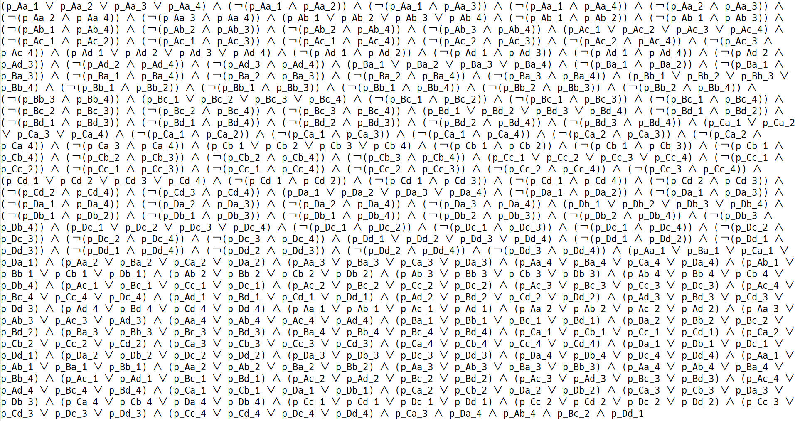
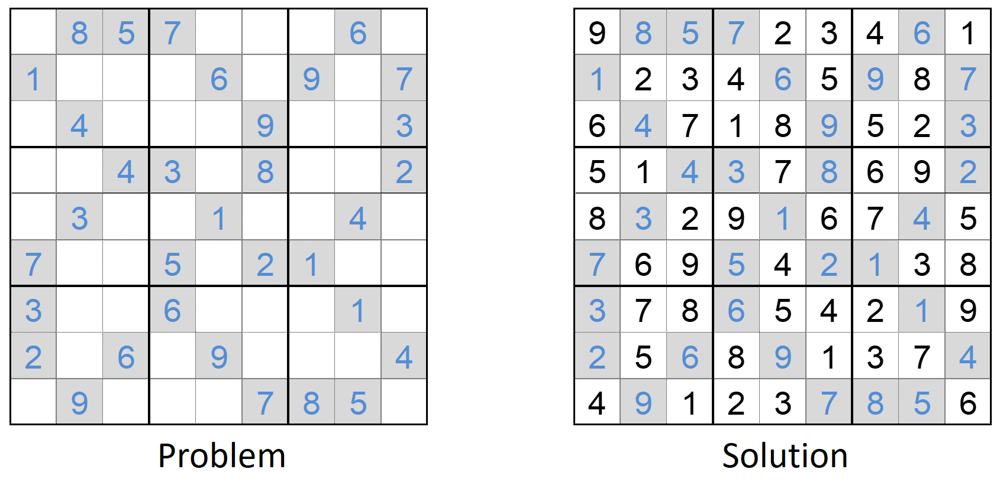

## 自己紹介

* [田辺良則](https://researchmap.jp/y-tanabe) (たなべ・よしのり)
  * [鶴見大学](https://www.tsurumi-u.ac.jp/) 文学部ドキュメンテーション学科教授 (本務)
  * [国立情報学研究所](https://www.nii.ac.jp/) [先端ソフトウェア工学・国際研究センター](http://grace-center.jp/) 特任教授 (併任)
* 研究領域
  * 計算機科学
  * ソフトウェア工学
* 研究内容
  * 論理学を使って，ソフトウェアの不具合を解消する方法を開発する

---

## 大学紹介

* 鶴見大学
  * 神奈川県横浜市鶴見区 (横浜市の東端)
  * 学生数2000名強
  * 總持寺 (曹洞宗大本山) が設立
  * 3学部 (他に歯学部と短期大学部)

---

## 大学紹介 (つづき)

* 文学部
  * 4学科 (他に 日本文学科・英語英米文学科・文化財学科)

* ドキュメンテーション学科
  * 1学年60名
  * 3コース:
    * 図書館学  ... 図書館に関する諸研究; 図書館司書の養成
    * 情報学    ... 計算機・情報技術
    * 書誌学    ... 江戸期以前の古典籍

---

## お願い

アンケートにご協力ください．

---

## 鶴亀算...

* 鶴の足は2本 &nbsp;&nbsp; 亀の足は4本
* 鶴と亀が合わせて10体いる．
* 足の数の合計は28
* 鶴は何羽で亀は何匹?

&nbsp;

* もし鶴10羽・亀0匹だったら ... 足は20本のはず．
* 実際は28本 ... 8本増やす必要がある．
* 鶴が1羽減って亀が1匹増えると ... 足は2本増える．
* $8 / 2 = 4$
* 鶴は $10 - 4 = 6$ 羽; &nbsp; 亀は $8 / 2 = 4$ 匹

---

## 方程式

* 鶴の足は2本 &nbsp;&nbsp; 亀の足は4本
* 鶴と亀が合わせて10体いる．
* 足の数の合計は28
* 鶴は何羽で亀は何匹?

&nbsp;

* 鶴: $x$羽; 亀: $y$匹
* $x + y = 10$
* $2x + 4y = 28$
* 答: $x = 6, y = 4$

---

## 比べてみると

* 鶴亀算
  * 賢く考えつかないと / この問題の解き方を知らないと 解けない
* 方程式
  * 機械的に解ける
  * そんなに賢くなくても解ける
  * 計算機に仕事をさせられる

記号化のメリット
<!-- .element: class="fragment myhl" -->

---

## 今日の計画

* 導入
* 日常論理から
* 論理パズル
* 記号論理
* 記号論理の応用～SATソルバー

---

## 日常論理・ケース1

* 「今度の日曜日，晴れたら公園に遊びに連れて行ってやる」

&nbsp;

* 日曜日，良い天気，快晴．
<!-- .element: class="fragment" -->

&nbsp;

遊びに連れて行ったか?
<!-- .element: class="fragment mycenter" -->

---

## 日常論理・ケース2

* X:「わたくし，お金持ちで美男子の方としか，お付き合いいたしません．」

&nbsp;

* Y:「昨日紹介されてたAさん，どうだった?」
<!-- .element: class="fragment" data-fragment-index="1"-->
* X:「お付き合いに値しない方でしたわ．」
<!-- .element: class="fragment" data-fragment-index="1"-->

&nbsp;

Aさんは金持ちではなかった，と結論して良いか?
<!-- .element: class="fragment mycenter" -->

---

## 日常論理・ケース3

* A:「僕，高望みしないから．
    お金持ちか，美人か，どっちかなら喜んで付き合っちゃう．」

&nbsp;

* B:「昨日紹介されてたXさん，どうだった?」
<!-- .element: class="fragment" data-fragment-index="1"-->
* A:「うーん，ちょっと条件に合わないかな．」
<!-- .element: class="fragment" data-fragment-index="1"-->

&nbsp;

Xさんは金持ちではなかった，と結論して良いか?
<!-- .element: class="fragment mycenter" -->

---

## 論理パズル・easy version

嘘つき村と正直村がある．嘘つき村の住人は常に嘘をつく．
正直村の住人は，常に真実を言う．

両村への左右の分かれ道に
詰所があり，両方の村から1人ずつ詰めている．
見かけではどちらが正直でどちらが嘘つきか分からない．
どちらか1人に，Yes/No で答えられる質問を1つだけして，
正直村への道が左か右かを知りたい．

どのように質問したら良いか?

---

## 論理パズル・hard version

嘘つき村・正直村への分かれ道に，
両方の村からの1人ずつと，よそ者が1人の，計3人がいる．
よそ者は，真実を言うかどうかわからない．
Yes/No で答えられる質問を2つだけして，正直村への道がどちらか知りたい．
1つの質問は1人にしかできないが，2つめの質問を誰に聞くかは，
1つめの質問の答を聞いてから決められる．

どのように質問したら良いか?

---

## easy version．失敗例．

「右が正直村への道ですか?」
<!-- .element: class="myhl" -->

* 右が正直村だった場合 <!-- .element: class="fragment" -->
  * 聞かれた人が正直者だったら: 
    Yes
  * 聞かれた人が嘘つきだったら: 
    No
* 左が正直村だった場合  <!-- .element: class="fragment" -->
  * 聞かれた人が正直者だったら:
    No
  * 聞かれた人が嘘つきだったら:
    Yes

---

* 右が正直村だった場合
  * 聞かれた人が正直者だったら: Yes
  * 聞かれた人が嘘つきだったら: No
* 左が正直村だった場合
  * 聞かれた人が正直者だったら: No
  * 聞かれた人が嘘つきだったら: Yes

&nbsp;

* 答が Yes だったとして，右に行ったら良いのか左に行ったら良いのかわからない．
* 答が No でも同じ．

&nbsp;

* Yes/No が揃う質問を考える!

---

## easy version 解答例．その1

「右が正直村への道かと聞かれたら，  
Yes と答えますか?」
<!-- .element: class="myhl" -->

* 右が正直村だった場合

  * 正直者に聞いた場合 ... Yes と答える．
  * 嘘つきに聞いた場合
    * 「右が正直村への道」 ... 正しい
    * 「と聞かれたら」 ... 嘘をつくから No と答える
    * 「Yes と答えます」... 正しくない．
    * 「か?」 ... 嘘をつくから，Yes と答える．

---

## easy version 解答例．その1

「右が正直村への道かと聞かれたら，  
Yes と答えますか?」
<!-- .element: class="myhl" -->

* 左が正直村だった場合

  * 正直者に聞いた場合 ... No と答える．
  * 嘘つきに聞いた場合
    * 「右が正直村への道」 ... 正しくない
    * 「と聞かれたら」 ... 嘘をつくから Yes と答える
    * 「Yes と答えます」... 正しい．
    * 「か?」 ... 嘘をつくから，No と答える．

---

## easy version 解答例．その1

「右が正直村への道かと聞かれたら，  
Yes と答えますか?」
<!-- .element: class="myhl" -->

* どちらに聞いても，
  * 答が Yes なら，右が正直村．
  * 答が No なら，左が正直村．

---

## easy version の解答例．その2

「右の道は，あなたの村への道ですか?」
<!-- .element: class="myhl" -->

* 右が正直村だった場合
  * 正直者に聞いた場合 ... Yes と答える．
  * 嘘つきに聞いた場合
    * 「右は自分の村への道」 ... 正しくない
    * 「ですか?」 ... 嘘をつくので Yes と答える．

---

## easy version の解答例．その2

「右の道は，あなたの村への道ですか?」
<!-- .element: class="myhl" -->

* 左が正直村だった場合
  * 正直者に聞いた場合 ... No と答える．
  * 嘘つきに聞いた場合
    * 「右は自分の村への道」 ... 正しい
    * 「ですか?」 ... 嘘をつくので No と答える．

---

## easy version の解答例．その2

「右の道は，あなたの村への道ですか?」
<!-- .element: class="myhl" -->

* どちらに聞いても，
  * 答が Yes なら，右が正直村．
  * 答が No なら，左が正直村．

---

## 記号論理

* 数式
  * 例: $ (p - q)^3 = p^3 - 3p^2q + 3pq^2 - q^3 $
  * 変数 $p, q, \ldots$ は，数を表す．
* 論理式<!-- .element: class="fragment" -->
  * 例: $ (p \lor q) \to r \leftrightarrow (p \to r) \land(q \to r) $
  * 変数 $p, q, r, \ldots$ は，命題を表す．
  * 命題: 真か偽が決まっていること．
    * 真 (true) = 成り立つ， 偽 (false) = 成り立たない．
    * 真と偽を合わせて，真理値と言う．

---

## 嘘つき村問題を解く

記号論理で，嘘つき村問題を解いてみよう．

---

## 論理演算子

| 演算子 | 読み方 | 意味 |
| :-: | :-: | :-: |
| $\neg p$ | $p$ でない | $p$ でない |
| $p \lor q$ | $p$ または $q$ | $p$ か $q$ の少なくとも一方は真 |
| $p \land q$ | $p$ かつ $q$ | $p$ と $q$ の両方が真 |
| $p \to q$ | $p$ ならば $q$ | $p$ が真で $q$ が偽ということはない |
| $p \leftrightarrow q$ | $p$ と $q$ は同値 | $p$ と $q$ の真偽は一致する． |

---

## 真理値の計算

| でない |
| :-: |
| $\neg\textbf{真} = \textbf{偽}$ |
| $\neg\textbf{偽} = \textbf{真}$ |

&nbsp;

| または | かつ | ならば | 同値
| :-: | :-: | :-: | :-: |
| $\textbf{真} \lor \textbf{真} = \textbf{真} $ | $\textbf{真} \land \textbf{真} = \textbf{真} $ | $\textbf{真} \to \textbf{真} = \textbf{真} $ | $\textbf{真} \leftrightarrow \textbf{真} = \textbf{真} $
| $\textbf{真} \lor \textbf{偽} = \textbf{真} $ | $\textbf{真} \land \textbf{偽} = \textbf{偽} $ | $\textbf{真} \to \textbf{偽} = \textbf{偽} $ | $\textbf{真} \leftrightarrow \textbf{偽} = \textbf{偽} $
| $\textbf{偽} \lor \textbf{真} = \textbf{真} $ | $\textbf{偽} \land \textbf{真} = \textbf{偽} $ | $\textbf{偽} \to \textbf{真} = \textbf{真} $ | $\textbf{偽} \leftrightarrow \textbf{真} = \textbf{偽} $
| $\textbf{偽} \lor \textbf{偽} = \textbf{偽} $ | $\textbf{偽} \land \textbf{偽} = \textbf{偽} $ | $\textbf{偽} \to \textbf{偽} = \textbf{真} $ | $\textbf{偽} \leftrightarrow \textbf{偽} = \textbf{真} $

<!--
| $p$ | $q$ | $p \land q$ | $p \lor q$ | $p \to q$ | $p \leftrightarrow q$ |
| :-: | :-: | :-: | :-: | :-: | :-: |
| 真 | 真　| 真 | 真 | 真 | 真 |
| 真 | 偽　| 偽 | 真 | 偽 | 偽 |
| 偽 | 真　| 偽 | 真 | 真 | 偽 |
| 偽 | 偽　| 偽 | 偽 | 真 | 真 |
-->

---

## 公式

$x \leftrightarrow (x \leftrightarrow y) = y$
<!-- .element: class="myhl" -->

証明:

* $x$ が真で $y$ が真のとき．
  * 左辺 = $\textbf{真} \leftrightarrow (\textbf{真} \leftrightarrow \textbf{真})$ = $\textbf{真} \leftrightarrow \textbf{真} = \textbf{真}$ = 右辺
* $x$ が真で $y$ が偽のとき．
  * 左辺 = $\textbf{真} \leftrightarrow (\textbf{真} \leftrightarrow \textbf{偽})$ = $\textbf{真} \leftrightarrow \textbf{偽} = \textbf{偽}$ = 右辺
* $x$ が偽で $y$ が真のとき．
  * 左辺 = $\textbf{偽} \leftrightarrow (\textbf{偽} \leftrightarrow \textbf{真})$ = $\textbf{偽} \leftrightarrow \textbf{真} = \textbf{偽}$ = 右辺
* $x$ が偽で $y$ が偽のとき．
  * 左辺 = $\textbf{偽} \leftrightarrow (\textbf{偽} \leftrightarrow \textbf{偽})$ = $\textbf{偽} \leftrightarrow \textbf{真} = \textbf{偽}$ = 右辺

---

## 嘘つき村問題

* 右の道が正直村である: $r$
* 回答者は正直者である: $h$

&nbsp;

* 質問が $Q$ であるとき，回答者の答は， $h \leftrightarrow Q$ である．
  * Yes を真，No を偽に解釈する．
* 回答者の答と，$r$の真偽が一致するようにしたい．
  * $Q$に関する方程式 $h \leftrightarrow Q = r$ を解きたい．

&nbsp;

* 方程式の両辺に 「$h \leftrightarrow$」を左から適用する: 
  $h \leftrightarrow (h \leftrightarrow Q) = h \leftrightarrow r$
* 公式より，$Q = h \leftrightarrow r$．「方程式の解」が得られた．

---

## 嘘つき村問題: 解釈1

* $Q = h \leftrightarrow r$
* ここで，次を思い出す:
  * $t$ を質問した時，回答者の答は， $h \leftrightarrow t$ である．
* つまり，質問としては，$r$ に対する回答者の答，を尋ねれば良い．

「右が正直村への道か，と聞かれたら  
あなたはYesと答えますか?」
<!-- .element: class="fragment myhl" -->

---

## 嘘つき村問題: 解釈2

* $Q = h \leftrightarrow r$
* 字面通りにに解釈する: 
「あなたが正直者であることと，右の道が正直村への道であることは同値ですか?」
* 「同値」を分解すれば次のようになる:
  * 次のうち少なくとも一方が成り立ちますか?
    * あなたが正直者で，右は正直村への道である．
    * あなたが嘘つきで，右は嘘つき村への道である．
* これは，次と同じことである:

右の道は，あなたの村への道ですか?
<!-- .element: class="fragment myhl" -->

---

記号論理を使うことで，  
機械的に  
嘘つき村問題を解くことができた．
<!-- .element: class="myhl" -->

---

## hard version. 失敗例．

「右が正直村への道かと聞かれたら，  
Yes と答えますか?」
<!-- .element: class="myhl" -->

* 右が正直村の場合
  * 正直者に聞く ... Yes
  * 嘘つきに聞く ... Yes
  * よそ者に聞く ... Yes または No
* 左が正直村の場合
  * 正直者に聞く ... No
  * 嘘つきに聞く ... No
  * よそ者に聞く ... Yes または No

---

* 右が正直村の場合
  * 正直者に聞く ... Yes
  * 嘘つきに聞く ... Yes
  * よそ者に聞く ... Yes または No
* 左が正直村の場合
  * 正直者に聞く ... No
  * 嘘つきに聞く ... No
  * よそ者に聞く ... Yes または No

よそ者に聞くと，質問に関係なく，適当に Yes/No を答えられてしまう = __情報がない__

---

## hard version．考え方

* 1つめの質問で，よそ者ではない者をみつける．
* 2つめの質問は，よそ者ではない者に対して，
  easy version の質問をそのまま使う．

以下，3人をA, B, C とする．

---

## hard version．失敗例 その2

Aに質問: 「あなたはよそ者ですか?」
<!-- .element: class="myhl" -->

* Aが正直者のとき ... No
* Aが嘘つきの時 ... Yes
* Aがよそ者の時 ... Yes または No

全然情報が無い!

---

## hard version．代案

Aに質問: 「Bはよそ者ですか?」
<!-- .element: class="myhl" -->

| A | B | C | 答 |
|:-:|:-:|:-:|:--:|
|正直者|嘘つき|よそ者| No |
|正直者|よそ者|嘘つき| Yes |
|嘘つき|正直者|よそ者| Yes |
|嘘つき|よそ者|正直者| No |
|よそ者|正直者|嘘つき| Yes または No |
|よそ者|嘘つき|正直者| Yes または No |

---

## hard version．代案

答が Yes だったら，可能性は:

| A | B | C | 答 |
|:-:|:-:|:-:|:--:|
|正直者|よそ者|嘘つき| Yes |
|嘘つき|正直者|よそ者| Yes |
|よそ者|正直者|嘘つき| Yes または No |
|よそ者|嘘つき|正直者| Yes または No |

3人ともよそ者の可能性がある．

---

## hard version．1つめの質問．代案

答が No だったら，可能性は:

| A | B | C | 答 |
|:-:|:-:|:-:|:--:|
|正直者|嘘つき|よそ者| No |
|嘘つき|よそ者|正直者| No |
|よそ者|正直者|嘘つき| Yes または No |
|よそ者|嘘つき|正直者| Yes または No |

3人ともよそ者の可能性がある．

失敗．
<!-- .element: class="myhl" -->

---

## hard version．1つめの質問．代案

「Bはよそ者ですか?」
<!-- .element: class="myhl" -->

| A | B | C | 答 |
|:-:|:-:|:-:|:--:|
|正直者|嘘つき|よそ者| No |
|正直者|よそ者|嘘つき| Yes |
|嘘つき|正直者|よそ者| Yes |
|嘘つき|よそ者|正直者| No |
|よそ者|正直者|嘘つき| Yes または No |
|よそ者|嘘つき|正直者| Yes または No |

3行目と4行目がひっくり返ってくれると良いのだが...

---

## hard version．1つめの質問．正解

「Bはよそ者かと聞かれたら，Yes と答えますか?」
<!-- .element: class="myhl" -->

| A | B | C | 答 |
|:-:|:-:|:-:|:--:|
|正直者|嘘つき|よそ者| No |
|正直者|よそ者|嘘つき| Yes |
|嘘つき|正直者|よそ者| No |
|嘘つき|よそ者|正直者| Yes |
|よそ者|正直者|嘘つき| Yes または No |
|よそ者|嘘つき|正直者| Yes または No |

ひっくり返った!

---

## hard version．1つめの質問．正解

「Bはよそ者かと聞かれたら，Yes と答えますか?」
<!-- .element: class="myhl" -->

答が Yes だったら，C はよそ者ではあり得ない．

| A | B | C | 答 |
|:-:|:-:|:-:|:--:|
|正直者|よそ者|嘘つき| Yes |
|嘘つき|よそ者|正直者| Yes |
|よそ者|正直者|嘘つき| Yes または No |
|よそ者|嘘つき|正直者| Yes または No |

2つめの質問は，
C に，「右が正直村への道かと聞かれたら，Yes と答えますか?」と聞けば良い．

---

## hard version．1つめの質問．正解

「Bはよそ者かと聞かれたら，Yes と答えますか?」
<!-- .element: class="myhl" -->

答が No だったら，B はよそ者ではあり得ない．

| A | B | C | 答 |
|:-:|:-:|:-:|:--:|
|正直者|嘘つき|よそ者| No |
|嘘つき|正直者|よそ者| No |
|よそ者|正直者|嘘つき| Yes または No |
|よそ者|嘘つき|正直者| Yes または No |

2つめの質問は，
B に，「右が正直村への道かと聞かれたら，Yes と答えますか?」と聞けば良い．

---

## hard version．別解

正直度合いを，正直者 > よそ者 > 嘘つき とする．

Aに質問:  
「Bの方がCより正直度合いが強いですか?」
<!-- .element: class="myhl" -->

---

| A | B | C | 答 |
|:-:|:-:|:-:|:--:|
|正直者|嘘つき|よそ者| No |
|正直者|よそ者|嘘つき| Yes |
|嘘つき|正直者|よそ者| No |
|嘘つき|よそ者|正直者| Yes |
|よそ者|正直者|嘘つき| Yes または No |
|よそ者|嘘つき|正直者| Yes または No |

2つめの質問は，1つめがYesなら C に，No なら Bに，
「右の道は，あなたの村への道ですか?」と聞けば良い．

---

## 宿題 (?)

hard version を，記号論理の方法で解いてみよう．

難しいが，挑戦を望む．

---

## 充足可能性判定

* 与えられる論理式を真にできるか? できるとしたらどうすれば良い?
  * 変数の真偽は自由に決められるものとする．

---

## 充足可能性判定: 例1

$p \land q $
<!-- .element: class="myhl" -->

真にできる? できるとすればどうすれば?

答: $p$ と $q$ をともに真にすれば良い．
<!-- .element: class="fragment" -->

---

## 充足可能性判定: 例2

$\neg p \lor \neg q $
<!-- .element: class="myhl" -->

真にできる? できるとすればどうすれば?

答: $p$ と $q$ をともに偽にすれば良い．
<!-- .element: class="fragment" -->

別の答: $p$ を偽，$q$ を真にしても良い．
    (全部の答を見つけたいわけではない．1つ見つければ十分．)
<!-- .element: class="fragment" -->

---

## 充足可能性判定: 例3

$ p \land q \land \neg p $
<!-- .element: class="myhl" -->

真にできる? できるとすればどうすれば?

答: できない
<!-- .element: class="fragment" -->

---

## 充足可能性判定: 例4(?)

真にできる? できるとすればどうすれば?

---

## SATソルバー

* SATソルバー (SAT solver): 充足可能性判定を行うソフトウェア
* [実験](http://dcm-trm.net/minisat/itl.html)
* ここ20年ほどで，劇的に性能が向上した．
* 多くの問題 (制約充足問題) を，SATソルバーを用いて解くことができる．
  * 工場におけるラインの効率的なスケジューリング
  * プロサッカーリーグ，野球リーグなどの年間スケジュールの作成
  * 学校の時間割の作成；教室の割当
  * 複雑な探索問題．ソフトウェアの不具合の解決
  * 数独，推理パズル

---

## 数独

---

## 数独

* ルール
  * 各行に同じ文字は1つだけ
  * 各列に同じ文字は1つだけ
  * 各ブロックに同じ文字は1つだけ

---

## 数独と充足可能性判定

たくさん変数を導入する:

* $p111$: 1行1列の値は1である．
* $p112$: 1行1列の値は2である．
...
* $p374$: 3行7列の値は4である．
...
* $p999$: 9行9列の値は9である．

合計 $9^3 = 729$ 個．

---

## 数独と充足可能性判定

ルールが論理式で表現できる．

* ルール: 3行目のどこかに，4という文字が現れる
  * 言い換え: 3行1列の値が4であるか，3行2列の値が4であるか，...，3行9列の値が4であるかのいずれかが成り立つ．
  * 論理式:&nbsp; 
  $p314 \lor p324 \lor p334 \lor \cdots \lor p394$
* ルール: 5行7列の値は，1から9までのどれかである
  * 論理式: &nbsp; 
  $p571 \lor p572 \lor p573 \lor \cdots \lor p579$
* ルール: 3列目に，5という文字が2回以上現れてはいけない
  <!--
  * 言い換え: 1行3列の値が5であることと，2行3列の値が5であることとは，同時には起こらない．1行3列と3行3列についても同じ．..., 8行3列と9行3列についても同じ．
  -->
  * 論理式: &nbsp;
  $\neg(p135 \land p235) \land \neg(p135\land p335) \land \cdots \land \neg(p835 \land p935)$

---

## 数独と充足可能性判定

* このように作った論理式を 「かつ」 でつなげる．
* さらに，初期配置の論理式も 「かつ」でつなげる．
  * 例: 初期配置で，1行2列の値が8だったら，$p128$ をつなげる．
* SATソルバーに，この論理式の，充足可能性問題を解かせる．
* SATソルバーが返した解が，数独の答である．
  * 例: 解の中で，変数 $p119$ が真になっていたら，1行1列の値は9である．

---

## まとめ

* 数学で，数を記号で表して計算や推論を行うように，
  記号論理学では，真偽を記号で表して計算や推論を行う．
  * 問題ごとに個別に考えずにすみ，一般的な解決が得られる．
  * 計算機に問題を解かせることができる．
* 充足可能性判定を行うソフトウェアであるSATソルバーを使うことで，
  多くの実用的な問題を解決することができる．
  (数独のような非実用的問題も解ける)
  
