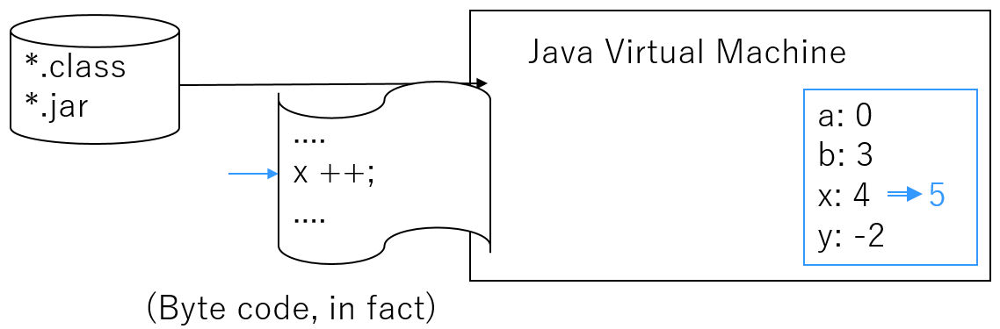
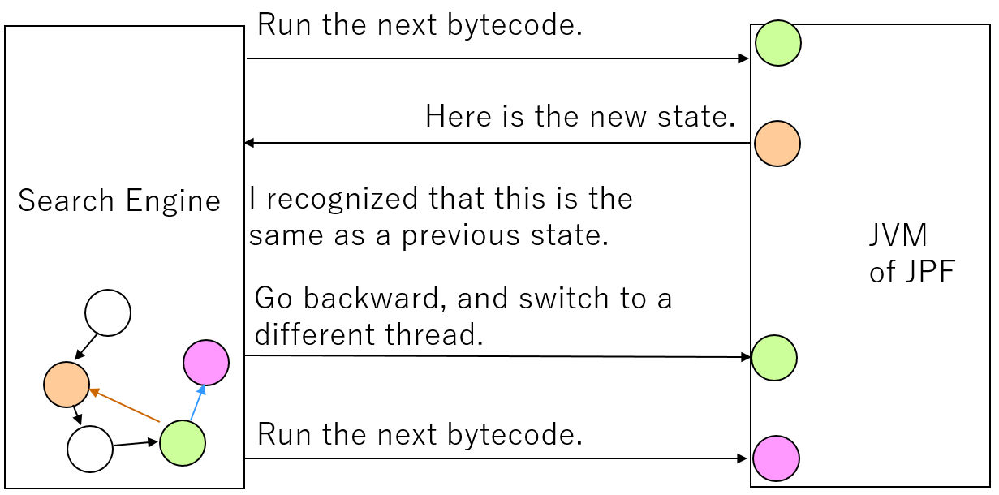
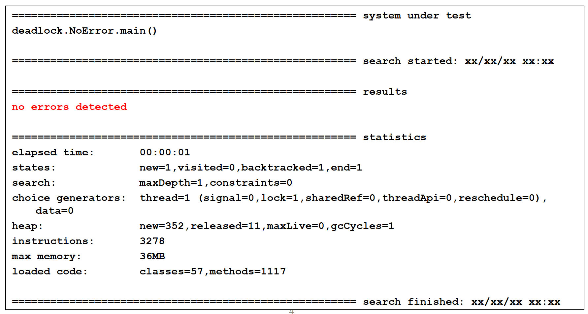
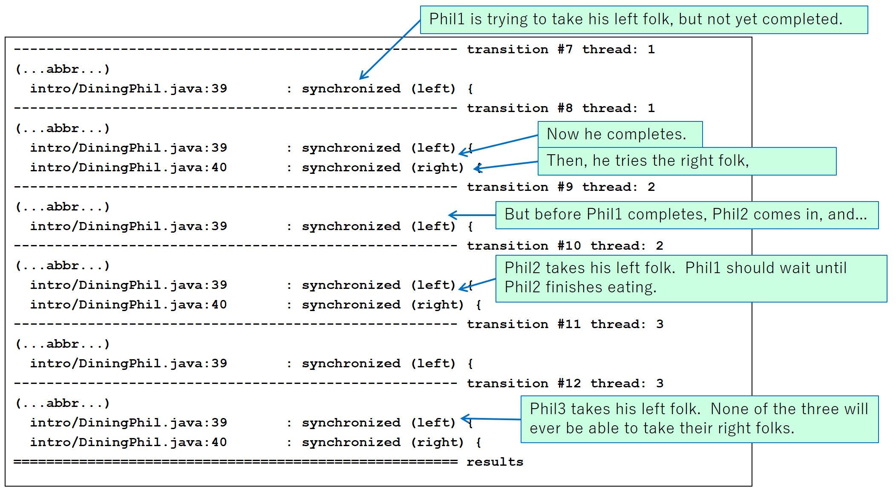

# Introduction

---

## Software Model Checking

* Model Checking
    * Explores transition systems to find problems
* Design Level
    * Manually generates transition systems (TS) using
	  description languages, such as Promela
    * <span style="color:red;">SPIN</span>, 
	  nuSMV, UPPAAL, PAT, Prism, ...
* Code Level
    * Model checkers automatically build transition systems
	  from source code / binaries.
    * <span style="color:red;">JPF</span>, 
	  Static Driver Verifier (SLAM), CHESS, ...
    * Easily suffered from the _state exploration problem_.

---

## Java PathFinder (JPF)

* A software model checker
* Target Language: Java
* Written in Java
* Open source
    * Originally developed by NASA
* JVM (Java Virtual Machine) of JPF
  runs Java byte code as usual, plus:
	* Goes back to previous states
	* Compares two states for identity
* [website](https://github.com/javapathfinder/jpf-core/wiki)

---

## Interleaving Model

* Branching (<span style="color:red;">non-determinism</span>)
  is essential in transition systems for model checking.
* Main source of non-determinism in Java program = 
  <span style="color:red;">multi-threading</span>
* In reality, Java threads runs parallelly on different CPU cores.
* JPF's run model 
  (<span style="color:red;">interleaving model</span>):
    * A thread runs a short amount of code.
	  During a thread runs, the other threads stops.
	* At any time, the running thread stops, and an thread
	  (possibly the same thread) is chosen to run.


---

## JPF Configuration


<small>
quoted from (an outdated) JPF website: http://javapathfinder.sourceforge.net
</small>

* Two main components: Java Virtual Machine / Search Engine
* Various parts are pluggable

---

## How JPF Runs (1)



* JPF has its own JVM.  It interprets class files.
* It can go forward, stop, go backward, etc; for a specified thread.


---

## How JPF Runs (2)



* Search Engine builds a TS, by geiitng info from JVM.
* JVM runs Java bytecode and builds states.

---

# Environment for Exercises

---

## Environment for Exercises

* Installation instructions for JPF/SPF are linked from the LMS.
* Download `svt19proj.zip` from the LMS
  and extract files.
* Add a line to your `site.properties` file:
```
proj-top = /full/path/to/svt19proj
```
    * Use slashes instead of backslashes even on MS Windows.

---

# Java Review


---

## Creating threads

* To make a thread:
    * Defines a derived class of class `Thread`.
    * Redefines method `run`.
* Method `start` creates and starts a thread that runs the contents
  of method `run`.
* Sample code: `MyThread1.java` (in directory `javaRev`)
    * Two threads `th1` and `th2` runs simultaneously.
    * Executing order varies from an execution to another.

---

## Synchronization

* Mutual exclusive control on objects
* You can write the following for any object `obj`.
    * `synchronized(obj) { ... }`
* Two threads cannot run synchronized blocks
  for a same object simultneously.  
  One thread need to wait for the other to complete the block.
  See `MyThread2.java`.
* Synchronized blocks for different objects can be run
  simultaneously.  See `MyThread3.java`.
* You can use synchronized method as well.  The following two
  are equivalent.
    * `synchronized method() { ... }`
    * `method() { synchronized(this) { ... } }`

---

## wait() and notifyall()

* Methods `obj.wait()` and `obj.notifyAll()` can be called in a
  block `synchronized(obj) { ... }`.
* A thread that calls obj.wait() abandons the lock and starts sleeping.
    * Note that wait() throws InterruptedException.
* When a thread calls obj.nofityAll(), 
  all threads that have been wait()ing on the object wake up.
  (But they can not yet run, until they acquire the lock.)

---

## wait() and notifyall()


---

## Exercise: Consumer-Producer

#### If you are not familiar with Java Threads...

* Read the source files in directory `prodCons`,
  and replace the busy loop with the code containing wait() and notifyAll().
* Answers are given in directories with name `'*-answer'`.

---

# JPF Basics

---

## Basic features

* JPF can detect:

    * Deadlocks

    * Uncaught exceptions

        * incl., assertion violations
	      (Exception `AssertionError`)

---

## Dining Philosophers

* Philosophers think usually and eat sometimes.
* They need two forks to eat.  
* Everyone insists on the order: 
  Take Left Folk - Take Right - Eat - Leave Right - Leave Left.


<br/>
<small>quoted from [Wikipedia](https://en.wikipedia.org/wiki/Dining_philosophers_problem).  (C) Benjamin D. Esham, CC BY-SA 3.0</small>

---

## Dining Philosophers

* Source `src/intro/DiningPhil.java` (copied from jpf-core/examples)
  is a simulator.
* You need a configuration file to start JPF.
  See `src/intro/diningPhil.jpf`.
* Run JPF as follows:
```
jpf src/intro/diningPhil.jpf
```
and you will get an error trace (counterexample) as expected.

---

## JPF Output with no error



---

## JPF Output


---

## Trace Information


---

## Duplicated Execution?

* A Java source line can appear two or more times
  even when it was executed only once.
    * JPF runs bytecodes and shows corresponding
	  line of the source.  The correspondance is n:1.
* Warning: At a <span style="color: red;">transition boundary</span>, 
  you should assume that the execution of the
  shown line 
  <span style="color: red;">has not yet been completed</span>.
* When in doubt, you can check executed bytecodes by:
```
report.console.show_code=true
```

---

## Dining Philosopher Trace

See `src/intro/diningPhil.log`.




---

### Exercise

* In dining philosophers, can we avoid deadlocks
  by changing one of the philosopher's ordering to
  Take Right - Take Left?  Will it be different if
  we change two instead of one when there are more philosophers than three?
  What is the necessary and sufficient condition of the order to
  avoid deadlocks?  Confirm it with JPF.


---

## Java Assertions

* Syntax:
```
assert p : m
```
    * p: expression to be checked, of type Boolean
    * m: error message (optional)
* Option `-ea` is needed for `java` command 
  to enable assertions.

---

### Exercise: AssertionTest

* Source: intro/AssertionTest.java
* Command line argument "1" or "2" is needed to start.
    * In a JPF configuration file, `target.args` can be used.
	  See assertiontest{1,2}.jpf.
* Quesion 1: When invoked with argument "1", the assertion in
  sub1() fails.  Modify the code so that it is satisfied.
  (Hint: `join` method of `Thread` class)
* Question 2: When invoked with argument "2", the assertion in
  sub2() fails.  Modify the code so that it is satisfied.

---

<!-- .slide: data-background="#ffe0e0" -->

# Assignment

---

<!-- .slide: data-background="#ffe0e0" -->

## Assignment of Lecture #5

* Code in directory `approve` intends to simulate
  the following flow, but does not work well due to bugs:
    * Proposer writes a Draft and put it on the Shelf
	  (if it is empty).
	* If a Draft that has not been checked (`!isChecked()`),
	  is on the Shelf, Checker takes it, put a confirmation
	  mark on it (`check()`), and returns it back onto the Shelf.
	* If a Draft that has been checked is on the Shelf,
	  Approver takes it, approves it, and send it to somewhere else
	  (out of scope).

---

<!-- .slide: data-background="#ffe0e0" -->

## Assignment of Lecture #5

* Questions:
    1. Run JPF against the code and find a path where
	   a deadlock occurs.  Explain the reason why it occurs.
	   Attach the error trace you got from JPF.
	2. Modify the program so that deadlocks do not happen,
	   and confirm it with JPF.
	   Note that there may be another problem than what you detect
	   for the first time.

<!-- .slide: id="working" -->

