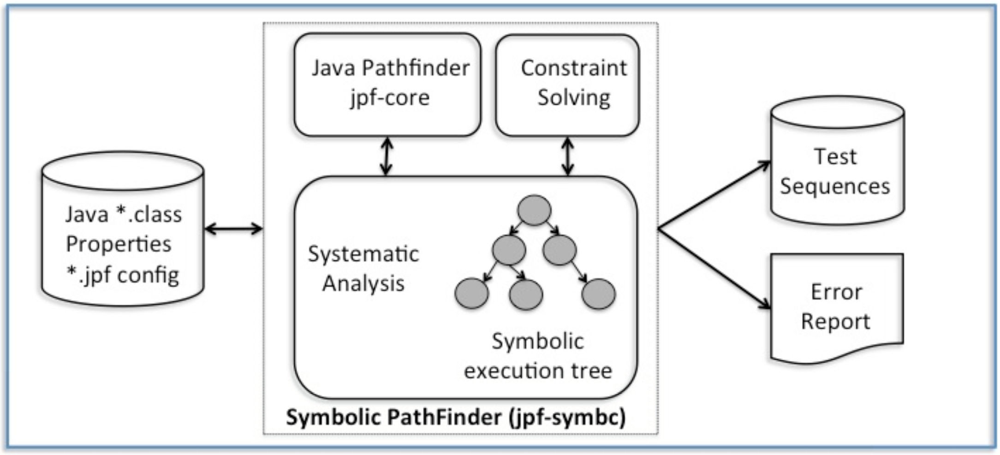
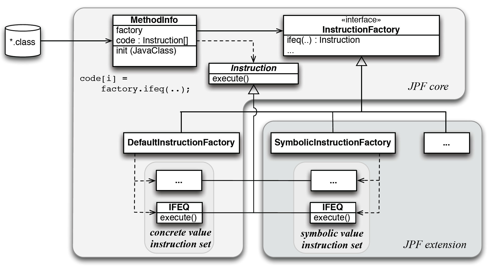
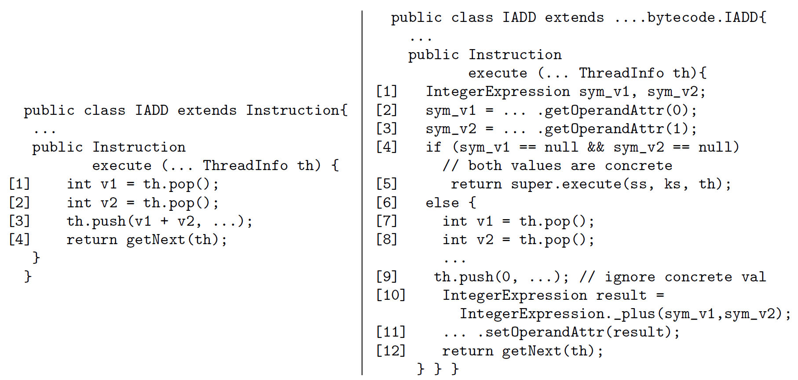

## Symbolic PathFinder

* Java PathFinder (JPF, a model checker) + Symbolic Execution
    * modules: jpf-core + jpf-symbc 
* JPF has a dedicated Java virtual machine
* SPF replaces the concrete bytecode interpretation with a
  symbolic interpretation
* Symbolic information is stored in attributes, which JPF provides
  for storing metadata.
* SPF uses JPF's mechanism to systematically generate execution paths.

<span style="font-size: 60%">
[Pasareanu13] Pasareanu et al.
Symbolic PathFinder: integrating symbolic execution 
with model checking for Java bytecode analysis.
<i>Automated Software Engineering</i>, vol. 20, 2013.  391-425 
</span>

---

## SPF Overview


<span style="font-size: 60%">(cited from [Pasareanu13])</span>

---

## Decision Procedures Used

* Z3
    * A SMT solver
    * This is the default solver.
* Choco
    * for integer/real constraints
	* pure Java
* IASolver
    * Interval Arighmetic Constraint Solver
	* pure Java
* CVC3
    * for real/integer linear arithmetic

---

## Example

```
public class BinarySearch {
	
	static boolean search(int[] mylist, int myitem) {
		int left = 0;
		int right = mylist.length - 1;
		while (left <= right) {
			int mid = (left + right) / 2;
			if (myitem == mylist[mid]) return true;
			if (myitem <  mylist[mid]) right = mid - 1;
			else                       left  = mid + 1;
		}
		return false;
	}
	
	static boolean driver(int i, int a0, int a1, int a2, int a3, int a4, int a5, int a6) {
		if ((a0 < a1) && (a1 < a2) && (a2 < a3) && (a3 < a4) && (a4 < a5) && (a5 < a6)) {
			int[] list = {a0, a1, a2, a3, a4, a5, a6};
			boolean b = search(list, i);
			boolean exp = (i == a0) || (i == a1) || (i == a2) || (i == a3) || (i == a4) || (i == a5) || (i == a6);
			if (b == exp) {
				return true;
			}else {
				assert(false);
				return false;
			}
		}else {
			return true;
		}
	}

	public static void main(String[] args) {
		boolean b = driver(0,0,1,2,3,4,5,6);
		System.out.print(b);
	}
}
```

---

## Results (Test Cases)

```C
Inputs: i_1_SYMINT,a0_2_SYMINT,a1_3_SYMINT,a2_4_SYMINT,a3_5_SYMINT,a4_6_SYMINT,a5_7_SYMINT,a6_8_SYMINT

BinarySearch.driver(3,0,1,2,3,4,5,6)  --> Return Value: 1
BinarySearch.driver(1,0,1,2,3,4,5,6)  --> Return Value: 1
BinarySearch.driver(0,0,1,2,3,4,5,6)  --> Return Value: 1
BinarySearch.driver(0,1,2,3,4,5,6,7)  --> Return Value: 1
BinarySearch.driver(1,0,2,3,4,5,6,7)  --> Return Value: 1
BinarySearch.driver(2,0,1,2,3,4,5,6)  --> Return Value: 1
BinarySearch.driver(2,0,1,3,4,5,6,7)  --> Return Value: 1
BinarySearch.driver(3,0,1,2,4,5,6,7)  --> Return Value: 1
BinarySearch.driver(5,0,1,2,3,4,5,6)  --> Return Value: 1
BinarySearch.driver(4,0,1,2,3,4,5,6)  --> Return Value: 1
BinarySearch.driver(4,0,1,2,3,5,6,7)  --> Return Value: 1
BinarySearch.driver(5,0,1,2,3,4,6,7)  --> Return Value: 1
BinarySearch.driver(6,0,1,2,3,4,5,6)  --> Return Value: 1
BinarySearch.driver(6,0,1,2,3,4,5,7)  --> Return Value: 1
BinarySearch.driver(7,0,1,2,3,4,5,6)  --> Return Value: 1
BinarySearch.driver(-9223372036854775808(don't care),0,1,2,3,4,5,0)  --> Return Value: 1
BinarySearch.driver(-9223372036854775808(don't care),0,1,2,3,4,0,-9223372036854775808(don't care))  --> Return Value: 1
BinarySearch.driver(-9223372036854775808(don't care),0,1,2,3,0,-9223372036854775808(don't care),-9223372036854775808(don't care))  --> Return Value: 1
BinarySearch.driver(-9223372036854775808(don't care),0,1,2,0,-9223372036854775808(don't care),-9223372036854775808(don't care),-9223372036854775808(don't care))  --> Return Value: 1
BinarySearch.driver(-9223372036854775808(don't care),0,1,0,-9223372036854775808(don't care),-9223372036854775808(don't care),-9223372036854775808(don't care),-9223372036854775808(don't care))  --> Return Value: 1
BinarySearch.driver(-9223372036854775808(don't care),0,0,-9223372036854775808(don't care),-9223372036854775808(don't care),-9223372036854775808(don't care),-9223372036854775808(don't care),-9223372036854775808(don't care))  --> Return Value: 1
```

---

## Demo 

* Bugs are detected with generated test cases.

---

## Symbolic Execution


<span style="font-size: 60%">(cited from [Pasareanu13])</span>


---

## Instruction Factory


<span style="font-size: 60%">(cited from [Pasareanu13])</span>

---

## Concrete and Symbolic Code for IADD


<span style="font-size: 60%">(cited from [Pasareanu13])</span>

---

## Concrete and Symbolic Code for IFGE


<span style="font-size: 60%">(cited from [Pasareanu13])</span>


---

## Mixed Concrete-Symbolic Solving

* Symbolic execution may fail due to 
    * incompleteness in DP
	* inability to handle external library calls
* Mixed concrete-symbolic solving
    * uninterpreted functions
	* delayed execution
* Incomplete.  May fail to judge as "satisfiable"

---

### Example

* PC: `X>0`, `Y>10`, `Y=hash(X)`
* Divides PC into two:
    * SimplePC: `X>0`, `Y>10`
	* ComplexPC: `Y=hash(X)`
* Solves the Simple PC to get `X=3`
* Delayed execution generates new PC: `Y=39` (assuming hash(X) = 39)
* Solves the mixed PC `X>0`, `Y>10`, `Y=39`, which is satisfiable.

&nbsp;

### Heuristics

* Generates multiple solutions for simplePC
    * up to a user-specified limit
* User-supplied partitions of the domain of an uninterpreted function
* Random values 
