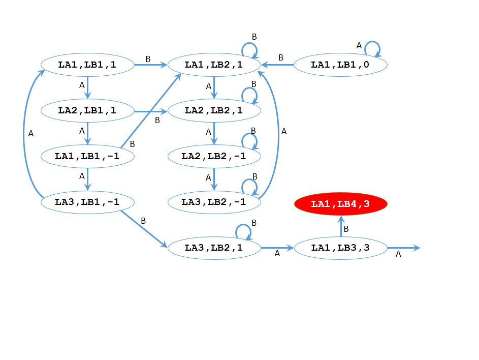
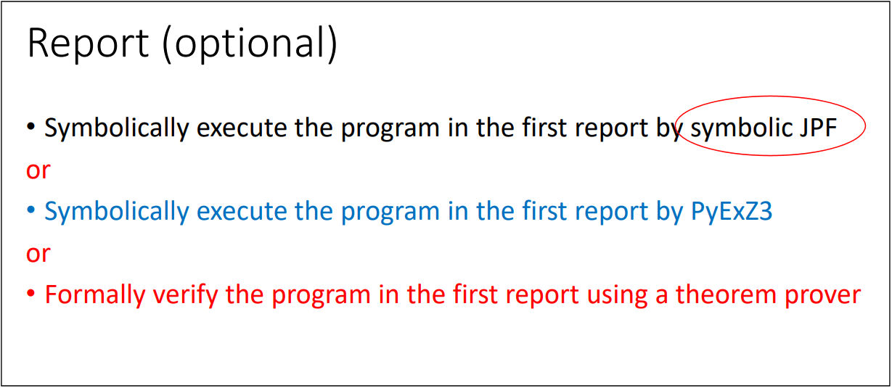
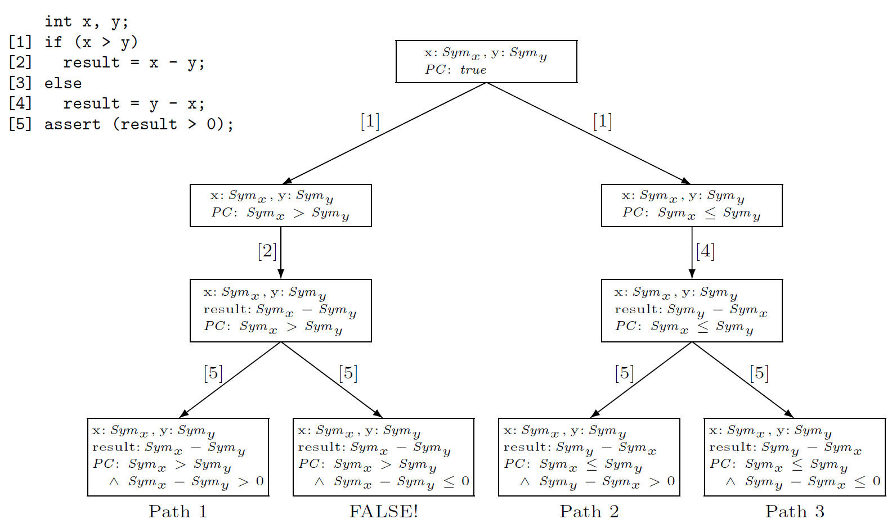
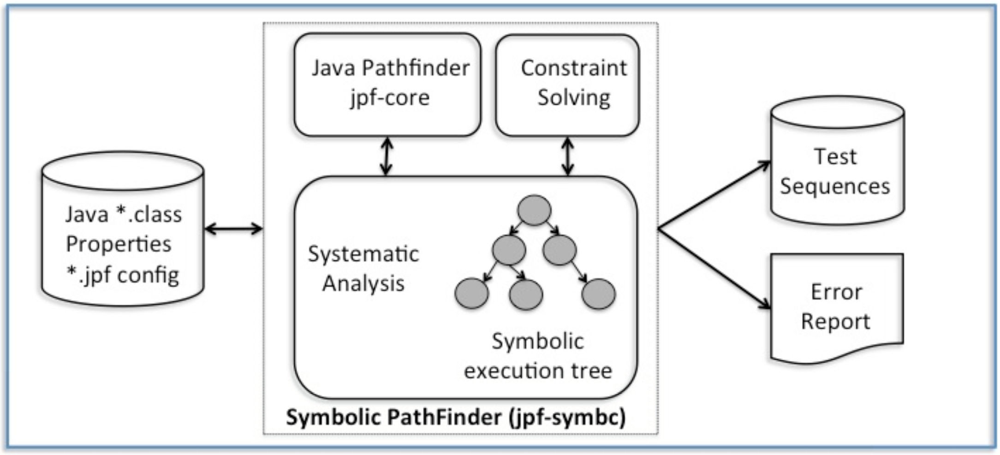
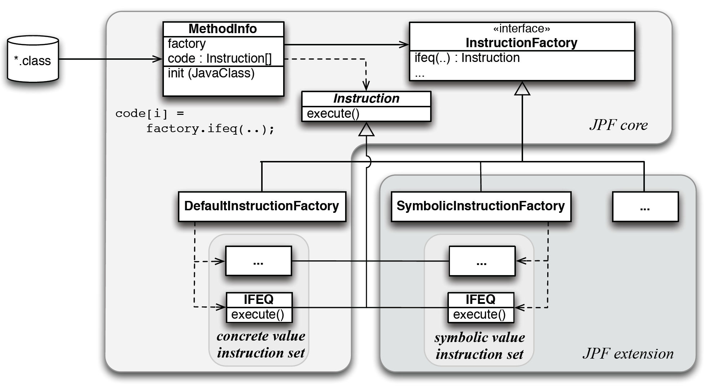
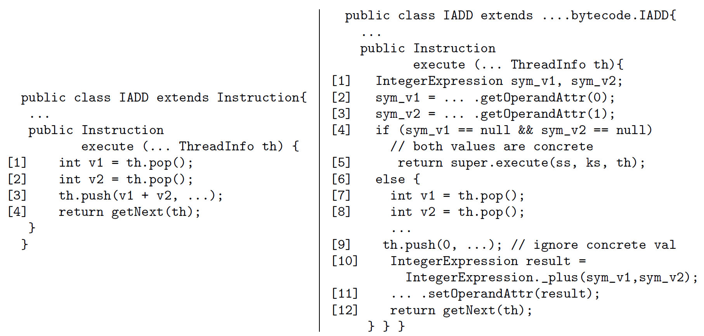
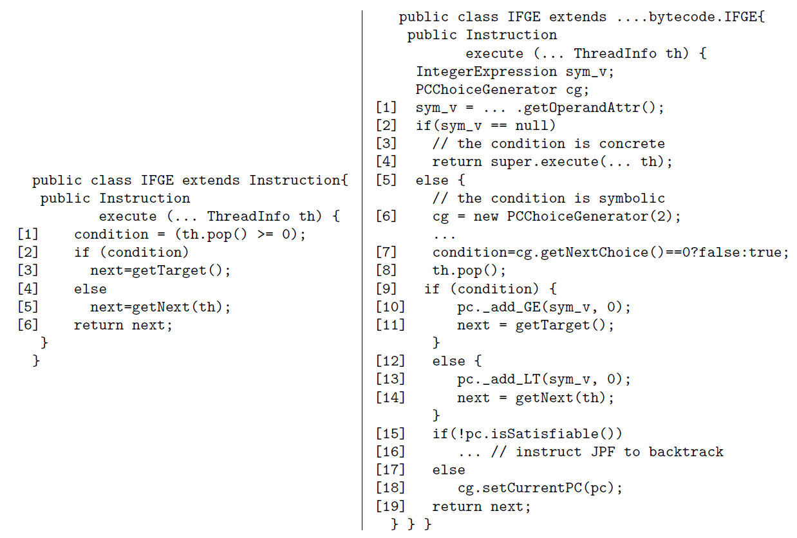
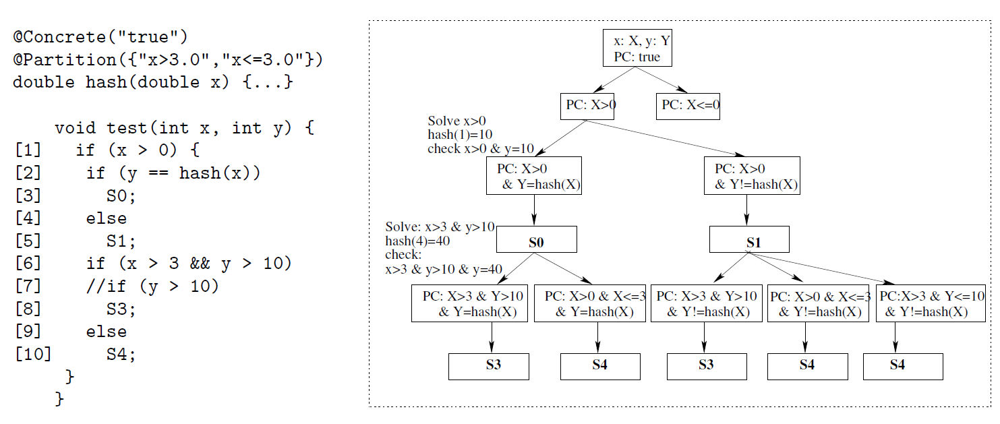

# Introduction

---

## Software Model Checking

* Model Checking
    * Explores transition systems to find problems
* Design Level
    * Manually generates transition systems (TS) using
	  description languages, such as Promela
    * <span style="color:red;">SPIN</span>, 
	  nuSMV, UPPAAL, PAT, Prism, ...
* Code Level
    * Model checkers automatically build transition systems
	  from source code / binaries.
    * <span style="color:red;">JPF</span>, 
	  Static Driver Verifier (SLAM), CHESS, ...
    * Often suffered from the _state explosion problem_.

---

## Java PathFinder (JPF)

* A software model checker
* Target Language: Java
* Written in Java
* Open source
    * Originally developed by NASA
* JVM (Java Virtual Machine) of JPF
  runs Java byte code as usual, plus:
	* Goes back to previous states
	* Compares two states for identity
* website: https://github.com/javapathfinder/jpf-core/wiki
* Extensions by contributors such as Symbolic Execution.


---

## Interleaving Model

* Branching (<span style="color:red;">non-determinism</span>)
  is essential in transition systems for model checking.
* Main source of non-determinism in Java program = 
  <span style="color:red;">multi-threading</span>
* In reality, Java threads runs parallelly on different CPU cores.
* JPF's run model 
  (<span style="color:red;">interleaving model</span>):
    * A thread runs a short amount of code.
	  During the thread runs, the other threads stop.
	* When the short run finishes, the thread stops.
	  Another thread (possibly the same thread) is selected,
	  and it runs a short amount of code.

---

## Do you remember ...

* Transition Systems



* JPF automatically constructs ttansition systems from Java code.


---

## JPF Configuration


<small>
quoted from (an outdated) JPF website: http://javapathfinder.sourceforge.net
</small>

* Two main components: Java Virtual Machine / Search Engine
* Various parts are pluggable

---

## How JPF Runs (1)


* JPF has its own Java Virtual Machine (JVM).  It interprets class files.
* It can go forward, stop, go backward, etc.; for a specified thread.


---

## How JPF Runs (2)


* Search Engine builds a transition system, 
  by getting information from JVM.
* JVM runs Java bytecode and builds states.

---

# Environment for Exercises

---

## Environment for Exercises

* [Installation instructions for JPF/SPF](https://is-trm.net/lect/svt-21/lectNote/install/jpf/). Also linked from the LMS.
* Download [svt21proj.zip](https://is-trm.net/lect/svt-21/lectNote/material/svt21-jpf.zip) and extract files in it.
* Add a line to your `site.properties` file:
```
proj-top = /full/path/to/your/directory/of/svt21proj
```
    * Use slashes instead of backslashes even on MS Windows.
* Comment the following line out for JPF.
```
# extensions = ${jpf-core},${jpf-symbc}
```
    * Make this line effective again when you run
      Symbolic PathFinder.

---

# Java Review


---

## Creating threads

* To make a thread:
    * Define a derived class of class `Thread`.
    * Redefine method `run`.
* Method `start` creates and starts a thread that runs the contents
  of method `run`.
* Sample code: `MyThread1.java` (in directory `javaRev`)
    * Two threads `th1` and `th2` run simultaneously.
    * The execution order is different for each execution.

---

## Synchronization

* Mutual exclusive control on objects
* You can write the following for any object `obj`.
    * `synchronized(obj) { ... }`
* No two threads can execute synchronization blocks 
  on the same object simultaneously.
  One thread needs to wait for the other to complete the block.
  See `MyThread2.java`.
* Synchronized blocks for different objects can be run
  simultaneously.  See `MyThread3.java`.
* You can use synchronized method as well.  The following two
  are equivalent.
    * `synchronized method() { ... }`
    * `method() { synchronized(this) { ... } }`

---

## wait() and notifyall()

* Methods `obj.wait()` and `obj.notifyAll()` can be called in a
  block `synchronized(obj) { ... }`.
* A thread that calls obj.wait() abandons the lock and starts sleeping.
    * Note that wait() throws InterruptedException.
* When a thread calls obj.nofityAll(), 
  all threads that have been wait()ing on the object wake up.
  (But they cannot yet run until they acquire the lock.)

---

## wait() and notifyall()


---

## Exercise: Consumer-Producer

#### If you are not familiar with Java Threads...

* Read the source files in directory `prodCons`,
  and replace the busy loop with the code containing wait() and notifyAll().
* Answers are given in directories with name `'*-answer'`.

---

# JPF Basics

---

## Basic features

* JPF can detect:

    * Deadlocks

    * Uncaught exceptions

        * incl., assertion violations
	      (Exception `AssertionError`)

---

## Dining Philosophers

* Philosophers usually think, and sometimes eat.
* They need two forks to eat.  
* Everyone insists on the order: 
  Take Left Folk - Take Right - Eat - Leave Right - Leave Left.


<br/>
<small>Quoted from 
<a href="https://en.wikipedia.org/wiki/Dining_philosophers_problem"
>Wikipedia</a>.
(C) Benjamin D. Esham, CC BY-SA 3.0</small>

---

## Dining Philosophers

* Source `src/intro/DiningPhil.java` (copied from jpf-core/examples)
  is a simulator for Dining Philosophers.
* You need a configuration file to start JPF.
  See `src/intro/diningPhil.jpf`.
* Run JPF as follows:
```
jpf src/intro/diningPhil.jpf
```
and you will get an error trace (counterexample) as expected.

---

## JPF Output with no error


---

## JPF Output


---

## Trace Information


---

## Duplicated Execution?

* A Java source line can appear two or more times
  even when it was executed only once.
    * JPF runs bytecodes and shows the corresponding line of the source.
	  The correspondence is n:1.
* Warning: At a <span style="color: red;">transition boundary</span>, 
  you should assume that the execution of the
  shown line 
  <span style="color: red;">has not yet been completed</span>.
* When in doubt, you can add the following line in `*.jpf` file
  to have JPF print executed bytecodes.

```
report.console.show_code=true
```

---

## Dining Philosopher Trace

See `src/intro/diningPhil.log`.


---

### Exercise

* In dining philosophers, can we avoid deadlocks
  by changing the order in which each philosopher takes forks?
* If there can be four or more philosophers,
  what is the necessary and sufficient condition on the order
  to avoid deadlocks?  Examine it with JPF.

---

## Java Assertions

* Syntax:
```
assert p : m
```
    * p: expression to be checked, of type Boolean
    * m: error message (optional)
* Option `-ea` is needed for `java` command 
  to enable assertions.

---

### Exercise: AssertionTest

* Source: intro/AssertionTest.java
* Command line argument "1" or "2" is needed to start.
    * In a JPF configuration file, `target.args` can be used.
	  See assertiontest{1,2}.jpf.
* Question 1: When invoked with argument "1", the assertion in
  sub1() fails.  Modify the code so that it is satisfied.
  (Hint: `join` method of `Thread` class)
* Question 2: When invoked with argument "2", the assertion in
  sub2() fails.  Modify the code so that it is satisfied.

---

<!-- .slide: data-background="#ffe0e0" -->

# Assignment

---

<!-- .slide: data-background="#ffe0e0" -->

## Assignment of Lecture #5

* Code in directory `approve` intends to simulate
  the following flow, but does not work well due to bugs:
    * The Proposer writes a Draft and put it on the Shelf
	  (if it is empty).
	* If a Draft that has not been checked (`!isChecked()`),
	  is on the Shelf, the Checker takes it, put a confirmation
	  mark on it (`check()`), and returns it back onto the Shelf.
	* If a Draft that has been checked is on the Shelf,
	  the Approver takes it, approves it, and sends it to somewhere else
	  (the final step is out of the scope).

---

<!-- .slide: data-background="#ffe0e0" -->

## Assignment of Lecture #5

* Tasks:
    1. Find a path where a deadlock occurs, and explain why it happens.
	   If you have run JPF with the code, it is a good idea to
	   attach the error trace from JPF to your report.
	2. Modify the program so that deadlocks do not occur.
	   Try to confirm it with JPF.  (You can still submit a report
	   if you fail to do that.)
	   Note that there may be a different issue from what you 
	   first detected.

<!-- .slide: id="working" -->

---

# Symbolic PathFinder

---

## A Reminder

Slide 23 of Symblic-Execution.pdf:




---

## Symbolic Execution



<span style="font-size: 60%">(cited from [Pasareanu13])</span>


---

## Model Checking and Symbolic Execution

* Both enumerate paths and explore all of them
* In symbolic execution:
  * Computation should be done symbolically
  * Satisfiability checking is needed to check if
    a path is feasible


&nbsp;

Model Checker + Symbolic Calculation + Sat Checker = Symbolic Execution Analyzer


---


## Symbolic PathFinder

* Java PathFinder (JPF, a model checker) + Symbolic Execution
    * modules: jpf-core + jpf-symbc 
* JPF has a dedicated Java virtual machine
* SPF replaces the concrete bytecode interpretation with a
  symbolic interpretation
* Symbolic information is stored in attributes, which JPF provides
  for storing metadata.
* SPF uses JPF's mechanism to systematically generate execution paths.

<span style="font-size: 60%">
[Pasareanu13] Pasareanu et al.
Symbolic PathFinder: integrating symbolic execution 
with model checking for Java bytecode analysis.
<i>Automated Software Engineering</i>, vol. 20, 2013.  391-425 
</span>

---

## SPF Overview



<span style="font-size: 60%">(cited from [Pasareanu13])</span>

---

## Decision Procedures Used

* Z3
    * A SMT solver
    * This is the default solver.
* Choco
    * for integer/real constraints
	* pure Java
* IASolver
    * Interval Arighmetic Constraint Solver
	* pure Java
* CVC3
    * for real/integer linear arithmetic

---

## Example

```
public class BinarySearch {
	
	static boolean search(int[] mylist, int myitem) {
		int left = 0;
		int right = mylist.length - 1;
		while (left <= right) {
			int mid = (left + right) / 2;
			if (myitem == mylist[mid]) return true;
			if (myitem <  mylist[mid]) right = mid - 1;
			else                       left  = mid + 1;
		}
		return false;
	}
	
	static boolean driver(int i, int a0, int a1, int a2, int a3, int a4, int a5, int a6) {
		if ((a0 < a1) && (a1 < a2) && (a2 < a3) && (a3 < a4) && (a4 < a5) && (a5 < a6)) {
			int[] list = {a0, a1, a2, a3, a4, a5, a6};
			boolean b = search(list, i);
			boolean exp = (i == a0) || (i == a1) || (i == a2) || (i == a3) || (i == a4) || (i == a5) || (i == a6);
			if (b == exp) {
				return true;
			}else {
				assert(false);
				return false;
			}
		}else {
			return true;
		}
	}

	public static void main(String[] args) {
		boolean b = driver(0,0,1,2,3,4,5,6);
		System.out.print(b);
	}
}
```

---

## Results (Test Cases)

```C
Inputs: i_1_SYMINT,a0_2_SYMINT,a1_3_SYMINT,a2_4_SYMINT,a3_5_SYMINT,a4_6_SYMINT,a5_7_SYMINT,a6_8_SYMINT

BinarySearch.driver(3,0,1,2,3,4,5,6)  --> Return Value: 1
BinarySearch.driver(1,0,1,2,3,4,5,6)  --> Return Value: 1
BinarySearch.driver(0,0,1,2,3,4,5,6)  --> Return Value: 1
BinarySearch.driver(0,1,2,3,4,5,6,7)  --> Return Value: 1
BinarySearch.driver(1,0,2,3,4,5,6,7)  --> Return Value: 1
BinarySearch.driver(2,0,1,2,3,4,5,6)  --> Return Value: 1
BinarySearch.driver(2,0,1,3,4,5,6,7)  --> Return Value: 1
BinarySearch.driver(3,0,1,2,4,5,6,7)  --> Return Value: 1
BinarySearch.driver(5,0,1,2,3,4,5,6)  --> Return Value: 1
BinarySearch.driver(4,0,1,2,3,4,5,6)  --> Return Value: 1
BinarySearch.driver(4,0,1,2,3,5,6,7)  --> Return Value: 1
BinarySearch.driver(5,0,1,2,3,4,6,7)  --> Return Value: 1
BinarySearch.driver(6,0,1,2,3,4,5,6)  --> Return Value: 1
BinarySearch.driver(6,0,1,2,3,4,5,7)  --> Return Value: 1
BinarySearch.driver(7,0,1,2,3,4,5,6)  --> Return Value: 1
BinarySearch.driver(-9223372036854775808(don't care),0,1,2,3,4,5,0)  --> Return Value: 1
BinarySearch.driver(-9223372036854775808(don't care),0,1,2,3,4,0,-9223372036854775808(don't care))  --> Return Value: 1
BinarySearch.driver(-9223372036854775808(don't care),0,1,2,3,0,-9223372036854775808(don't care),-9223372036854775808(don't care))  --> Return Value: 1
BinarySearch.driver(-9223372036854775808(don't care),0,1,2,0,-9223372036854775808(don't care),-9223372036854775808(don't care),-9223372036854775808(don't care))  --> Return Value: 1
BinarySearch.driver(-9223372036854775808(don't care),0,1,0,-9223372036854775808(don't care),-9223372036854775808(don't care),-9223372036854775808(don't care),-9223372036854775808(don't care))  --> Return Value: 1
BinarySearch.driver(-9223372036854775808(don't care),0,0,-9223372036854775808(don't care),-9223372036854775808(don't care),-9223372036854775808(don't care),-9223372036854775808(don't care),-9223372036854775808(don't care))  --> Return Value: 1
```

---

## Demo 

* Bugs are detected with generated test cases.

---

## Instruction Factory



<span style="font-size: 60%">(cited from [Pasareanu13])</span>

---

## Concrete and Symbolic Code for IADD



<span style="font-size: 60%">(cited from [Pasareanu13])</span>

---

## Concrete and Symbolic Code for IFGE



<span style="font-size: 60%">(cited from [Pasareanu13])</span>


---

## Mixed Concrete-Symbolic Solving

* Symbolic execution may fail due to 
    * incompleteness in the decision procedure
	* inability to handle external library calls
* Mixed concrete-symbolic solving
    * uninterpreted functions
	* delayed execution
* Incomplete.  May fail to judge as "satisfiable"

---

### Example



* Assume hash(1) = 10, hash(2) = 20, hash(4) = 40.
* Path Conditions (PC) for S0-S3: `X>3`, `Y>10`, `Y=hash(X)`
* Divides PC into two:
    * SimplePC: `X>3`, `Y>10` / ComplexPC: `Y=hash(X)`
* Solves the Simple PC to get `X=4`
* Delayed execution generates new PC: `Y=40`.
* Solves the mixed PC `X>0`, `Y>10`, `Y=40`, which is satisfiable.

---

### Heuristics

* Changing [6] to [7] makes things difficult:
  * SimplePC: `X>0`, `Y>10` / ComplexPC: `Y=hash(X)`
  * The solver returns `X=1` for SimplePC and hash(1) = 10
* Heuristics
  * Generates multiple solutions for simplePC
    * up to a user-specified limit
  * User-supplied partitions of the domain of an uninterpreted function
  * Random values 

---

## Summary

### Java PathFinder (JPF)

* Code-level model checker for Java programs
* Two main components
  * Search Engine (Pluggable)
  * Dedicated JVM for state management and backtracking

### Symbolic PathFinder (SPF)

* An extension to JPF
* Symbolic execution


---

## In the Next Lecture

* LTL model checking in JPF
  * ABP again, code level this time
  * Fairness and Liveness Properties
